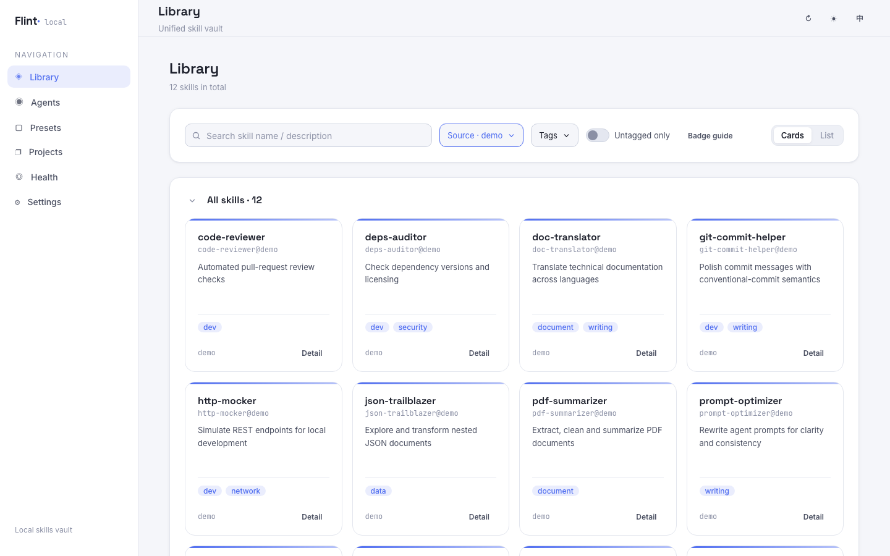

# Flint

<!--
schema.org structured data for SEO/GEO indexing. GitHub does not execute this script, but the raw JSON-LD is visible to search engines and AI engines that scan repository READMEs.
-->

<!--
<script type="application/ld+json">
{
  "@context": "https://schema.org",
  "@type": "SoftwareApplication",
  "name": "Flint",
  "alternateName": "local-skills-hub",
  "applicationCategory": "DeveloperApplication",
  "operatingSystem": "macOS, Linux, Windows",
  "description": "Flint is a local-first personal AI skills asset manager. Collect, tag, deduplicate and distribute your AI skills across agents (Claude Code, Cursor, Codex) and projects. Skills live as plain SKILL.md directories on disk — no cloud, no account, never locked in.",
  "url": "https://github.com/lcy362/flint",
  "installUrl": "https://www.npmjs.com/package/flint-skills-hub",
  "downloadUrl": "https://github.com/lcy362/flint",
  "softwareVersion": "0.1.0",
  "license": "https://opensource.org/licenses/MIT",
  "keywords": "AI skills manager, claude skills manager, skills hub, local-first skills, personal AI skills, claude code skills, skill asset manager",
  "offers": {
    "@type": "Offer",
    "price": "0",
    "priceCurrency": "USD"
  },
  "author": {
    "@type": "Person",
    "@id": "https://lichuanyang.top/#author",
    "name": "SandGrid",
    "alternateName": "lcy362",
    "url": "https://lichuanyang.top/",
    "sameAs": [
      "https://github.com/lcy362",
      "https://flint.lichuanyang.top/"
    ]
  }
}
</script>
-->
> English | [简体中文](./README.zh-CN.md)

[](https://www.npmjs.com/package/flint-skills-hub)
[](https://www.npmjs.com/package/flint-skills-hub)
[](https://www.npmjs.com/package/flint-skills-hub)

> **Flint** · `local-skills-hub`
> Obsidian collects knowledge; flint sparks skills.

**Make skills a personal asset.**

Flint is a local-first personal AI skills asset manager — it centralizes the skills used by all of your agents, with unified tagging, filtering, deduplication, and deployment into agent and project directories. Skills exist only as plain files on your local disk, versionable with git or whatever you prefer; if you move to another tool or ecosystem, the asset comes with you and keeps working — you are never locked in by Flint.



*Manage, tag and distribute your AI skills across agents and projects — all local, all yours.*

## Why "Flint"

Obsidian is a naturally sharp volcanic glass that early humans knapped into blades — one of the earliest tool materials. The knowledge app Obsidian takes its name from this: may you hone what you have learned into a handy edge.

**Flint** is the other "tool stone", a companion to obsidian. Flint follows the same "stone as tool" naming lineage, only it polishes **skills** instead of knowledge, and maps flint's two properties onto the product's two core actions:

- **Knapping** — striking a raw stone into a precise, handy tool: gather scattered skills, deduplicate them, tag them, and turn them into reusable personal assets.
- **Spark** — flint striking steel produces sparks: deploy / distribute skills into agent and project directories so they are truly ignited and start doing work.

> Every skill you collect is a piece of flint waiting to strike a spark.

## A philosophy in line with Obsidian

Flint's core idea is exactly the same as [Obsidian](https://obsidian.md/)'s — only the object of management changes from "knowledge" to "skills". Obsidian's own words about its philosophy:

> **Sharpen your thinking.** The free and flexible app for your private thoughts.
>
> **Your thoughts are yours.** "Obsidian stores notes privately on your device… No one else can read them, not even us."
>
> **Your knowledge should last.** "Obsidian uses open file formats, so you're never locked in. You own your data for the long term."

Flint aligns with each of these:

| Obsidian's philosophy | Flint's counterpart |
|------|------|
| **Local and private**: notes live privately on your device; no one else can read them, not even the vendor | Skills exist only as plain files on your local disk — no cloud, no account, no telemetry; metadata lives where the open ecosystem agrees on, not in a proprietary database |
| **Open formats, never locked in**: open file formats mean you are never locked out and own your data long term | A skill's body is just a `SKILL.md` directory on disk — open, edit, diff, and commit it with git at any time; switch tools or ecosystems and the asset comes with you, never locked in by Flint |
| **Sharpen your thinking**: Obsidian makes your personal knowledge base sharper with use | Flint makes your personal skill library handier as it grows — collect, deduplicate, tag, then deploy in one click to the agents and projects that need it |

In one sentence: **Obsidian lets you own and sharpen your knowledge; Flint lets you own and sharpen your skills.** Both share the same underlying beliefs — local-first, files as assets, never locked in.

## Documentation

| Document | Contents |
|------|------|
| This file / [README.zh-CN.md](./README.zh-CN.md) | Quick start and feature overview |
| [`AGENTS.md`](./AGENTS.md) | Development guide for AI coding assistants / contributors (architecture, conventions, commands) |
| [`docs/PRD.md`](./docs/PRD.md) | Product requirements (features, rules, acceptance criteria) |
| [`docs/TECH.md`](./docs/TECH.md) | Technical architecture (data model, sync engine, API, frontend) |
| [`docs/RELEASE.md`](./docs/RELEASE.md) | Release process (versioning, release notes, npm publishing) |

## Core ideas

### Make skills a personal asset

Your skill repository is your own personal asset, **not tied to any single system**. It lives only on your local filesystem; manage and version it with git or anything you like. If you later move to another tool or ecosystem, the asset comes with you and keeps working — never locked in by this tool.

### Your skills are your files

A skill's body is just an ordinary directory on disk (`SKILL.md`), and metadata such as tags is stored in ways the open ecosystem agrees on, not in a private database. You can open, edit, diff, and commit these files at any time — you always hold all of the data.

### Stay close to the open ecosystem

Tags and other metadata land in places the ecosystem already agrees on:

- **Top-level `tags` in the skill file (recommended)**: written into the frontmatter of each `SKILL.md`, natively read by 40+ tools including Claude Code and agentskills.io, and versioned together with the skill directory and git.
- **Staged here + migratable**: tags not yet written back to frontmatter are staged in local config; the Library's "tag migration" or the Health page can write them back to `SKILL.md` in one click.

### Reduce ecosystem fragmentation

When same-named skills come from multiple sources, deduplication keeps one copy; duplicates, divergence, and broken references are surfaced on the Health page and handled in place — avoiding the same skill ballooning into multiple copies across your environment.

## Features at a glance

| Module | Capabilities |
|------|------|
| **Library** | Browse / search / filter all skills; `SKILL.md` preview, tag editing, provenance; register / edit own and third-party repositories; collect from agents, import from directories |
| **Agents** | One card per actual skill directory (agents sharing a directory merge into one card and share one strategy); set active, override directories, one-click "Add from the vault" / delete, "Apply preset" one-shot deploy, per-skill symlink / copy |
| **Presets** | A skill bundle (explicit members ∪ linked-tag matches); press "Apply preset" to deploy it into a directory once — later membership or tag changes need another apply |
| **Projects** | Register a project + tags → tags act as the deployment policy; "Sync" copies the matches into `.agents/skills` (git-committable) and shares them by symlink into each agent's project directory; supports collect / takeover / push back to repository |
| **Health** | 6-dimension checkup (sync / duplicates / broken links / config / repositories / projects) with one-click fixes (confirm before running) |
| **Settings** | Interface language (English / Chinese), default install mode (symlink / copy), custom agents, log viewing / download / copy diagnostics |

## First run

The workflow has two layers — "essential" and "advanced". **Getting started takes four essential steps: install, register a repository, create a preset, and apply the preset to an agent.**

### ✅ Essential workflow

#### 1. Install

Requires Node.js ≥ 20.

**From npm — no clone needed:**

```bash
# One-shot run:
npx flint-skills-hub

# Or install globally; both command names are registered:
npm install -g flint-skills-hub
flint
```

Then open **http://localhost:8787**. Both commands are registered, with the same flags below.

#### 2. Command reference

| Command | Description |
| --- | --- |
| `flint` | Start the server and open the browser — the only overarching command |
| `flint -p 9000` / `flint --port 9000` | Listen on a custom port (default `8787`, or `$PORT`) |
| `flint -r` / `flint --restart` | Force-stop whatever already occupies the port, then start fresh |
| `flint --no-open` | Start without auto-opening the browser (CI / headless) |
| `flint -h` / `flint --help` | Show usage |
| `flint -v` / `flint --version` | Print the installed version |

Same flags work with `flint-skills-hub` (e.g. `flint-skills-hub -r`).

| Environment variable | Meaning |
| --- | --- |
| `PORT` | Same as `--port` |
| `FLINT_CONFIG` | Config file path (default `~/.flint/config.json`) |
| `FLINT_CLIENT_DIST` | Override the built Web UI directory |

**Updating, and checking the version:**

```bash
npm install -g flint-skills-hub@latest     # update the global install (pin it with @1.0.0 if you prefer)
flint -v                                   # print the version in use
npm ls -g --depth=0 flint-skills-hub       # what is installed globally
```

- A running instance is **not hot-updated** — stop it (`Ctrl+C`) and start it again.
- `npx` caches packages, so ask for the version explicitly: `npx flint-skills-hub@latest`.
- Running from a source checkout instead: `git pull && npm install && npm run build`.
- Updating never touches your data — `~/.flint/config.json`, your repositories and your agents' skill directories are left as they are.
- With nvm, every Node version keeps its own global packages: reinstall under the Node version you actually run `flint` with (`which -a flint` shows where the command comes from).

**From source — one-click start (recommended):**

```bash
./start.sh
```

The script checks the Node.js version, dependencies, and port availability, then opens the page in your browser once the frontend is ready; press `Ctrl+C` in the terminal to stop.

- The first run runs `npm install` automatically
- If a port is occupied you will be prompted; `./start.sh -y` kills the occupying process directly. See `./start.sh -h` for options
- Custom ports: `CLIENT_PORT=5174 SERVER_PORT=8788 ./start.sh`

Or start manually:

```bash
npm install
npm run dev
```

- Frontend (Web UI): http://localhost:5173/
- Backend (API): http://localhost:8787/

Config and logs live in `~/.flint/` (`config.json` and `logs/app.log`).

#### 2. Register a repository

A repository is the collection / source of truth for skills, mapped to a directory on disk. At the bottom of the **Library** page, in the "Repositories" section, click **Register repository**:

- **Own repository**: enter an ID and a directory path, choose a layout (`auto` detection by default). The "Choose…" button next to the path field opens the native system directory picker.
- **Third-party repository**: registered the same way and maintained as a read-only source (`linked`); its skills can be "imported" into own repositories.

#### 3. Create a preset

On the "Presets" page in the sidebar, click "New preset" and give it a name; open the detail page to add skills or link tags. A preset is a skill bundle.

#### 4. Apply the preset to an agent

Open an agent's detail page:

- Pick your new preset under "Linked preset";
- Press **"Apply preset"** — every skill configured in that preset is deployed into the
  directory once (symlink or copy, following the directory's install mode).

From then on the directory is the source of truth: whatever physically sits there is what the
agent sees. Skills are placed in a single shot — **applying a preset and adding a skill are
one-shot actions, and vault / preset changes never sync back on their own**; run
"Apply preset" again to pick up later membership or tag changes. Use the skills in projects or
agents as needed.

> A preset is only delivered to agents **linked to it**: no link means no follow — presets are never applied globally. An agent without a linked preset still works — use "Add from the vault" on its detail page to deploy skills one by one.
>
> The active set is organisational: it marks a directory and scopes the Health check, rather than acting as a trigger. Directories outside it are labelled as such, and either way there is nothing to auto-sync.

> At this point the minimal path "register repository → configure preset → deliver to agent" is complete, and your skills are live.

### 🔸 Advanced (optional)

- **Collect skills**: on an own-repository card, click "Add skills" → "Collect from agents", pick skills grouped by agent (select a whole group at once); the confirmation page merges candidates by name, and when the repository already has a same-named skill you can "keep as is" or "overwrite with an agent's version"; after confirming, each write path is shown before execution. You can also "Collect to repository" for a single skill on agent and project detail pages.
- **Take over**: replace entries in an agent directory with **symlinks to the repository copy** (keep only one body); in projects they are replaced with **real copies** (`.agents` is committed and self-contained across machines).
- **Import external directories**: own repository "Add skills" → "Import from folders", add source directories (system picker available, one per line; flat / nested categories / indexed catalog structures are supported) → "Detect" → "Start import"; same names are deduplicated automatically, and source directories serve as data sources only and are not registered.
- **Browsing and filtering**: all lists support "cards / list" views (cards by default; the preference is remembered globally); the Library's search, source, tag, and untagged filters live in one filter bar, with a "Reset" button appearing when filters are active.
- **Tagging**: click a card in the Library to open its detail; add or remove tags in the tag area; preview `SKILL.md` and view provenance right there.
- **Page state lives in the URL**: top-level pages, detail views, and filter conditions are all encoded in the address bar, so refreshes and shared links restore the same view.
- **Project-specific skills**: register a path + tags in the "Projects" module; matching skills enter the project's `.agents/`; changes can be "pushed back to the repository", and the project skill directory can be deployed into each agent's project-level directory.
- **Health and fixes**: the "Health" page runs a 6-dimension checkup (sync / duplicates / broken links / config / repositories / projects) with one-click fixes (confirm before running).
- **Sync strategy**: symlink by default; switch to copy per agent or per skill on the agent detail page. A copy is independent, so after editing a skill in the vault re-run the deploy for that directory ("Apply preset" / "Add").
- **Interface language**: switch between English and Chinese on the "Settings" page; the change applies to UI copy and to messages returned by the server, and the preference is remembered locally.

## Project structure

```
flint/  (local-skills-hub)
├─ start.sh          # One-click start (env / deps / port checks → start → open browser)
├─ README.md         # English guide (default, this file)
├─ README.zh-CN.md   # Chinese guide
├─ AGENTS.md         # Development guide (for AI assistants / contributors)
├─ docs/
│  ├─ PRD.md         # Product requirements
│  └─ TECH.md        # Technical architecture
├─ server/           # Backend (Node + TS + Express): scanning, sync, config, diagnostics
└─ client/           # Frontend (React + TS + Vite): Library / Agents / Presets / Projects / Health / Settings
```

## Development

```bash
npm install            # Install dependencies (npm workspaces)
npm run dev            # Start frontend and backend together
npm run dev:server     # Backend only (tsx watch)
npm run dev:client     # Frontend only (vite)
npm run build          # Build: server (tsc) + client (vite build)
npm start              # Start the backend from build output
npm test               # Unit tests (vitest)
npm run smoke -w server  # End-to-end smoke
node bin/flint.mjs --no-open   # Run the CLI the way the npm package does
```

- Ports: backend `8787` (`PORT`), frontend `5173` (`CLIENT_PORT`); Vite proxies `/api` to the backend.
- Unit tests run in a temp sandbox; the end-to-end smoke also uses a temp directory and never touches your machine.
- Release process: see [`docs/RELEASE.md`](./docs/RELEASE.md).
- Config / log locations: `~/.flint/config.json`, `~/.flint/logs/app.log` (override the config path with `FLINT_CONFIG`).
- Logs are always written in English for easy searching and issue reporting; the interface supports English and Chinese.

See [`docs/TECH.md`](./docs/TECH.md) for architecture and conventions, and [`AGENTS.md`](./AGENTS.md) for the development guide.
