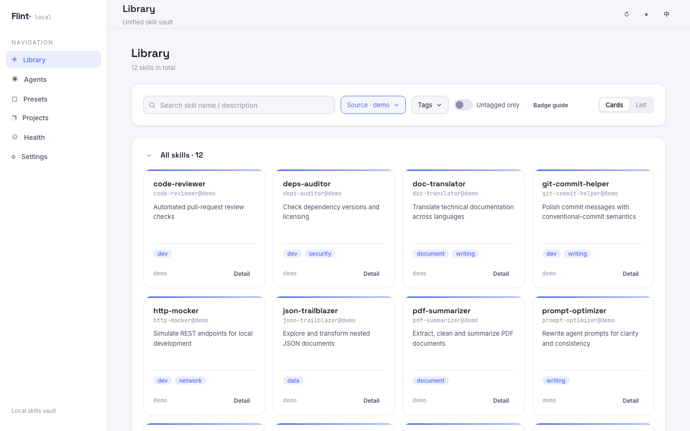

# Flint

> [English](./README.md) | 简体中文

[](https://sonarcloud.io/summary/new_code?id=lcy362_flint)
[](https://sonarcloud.io/component_measures?id=lcy362_flint&metric=coverage)
[](https://sonarcloud.io/component_measures?id=lcy362_flint&metric=reliability_rating)
[](https://sonarcloud.io/component_measures?id=lcy362_flint&metric=security_rating)
[](https://sonarcloud.io/component_measures?id=lcy362_flint&metric=sqale_rating)

> **Flint** · `local-skills-hub`
> 黑曜石收藏知识，燧石点燃技能。

**让 skill 成为个人资产——并且主权归你。**

Flint 是一个本地优先的个人 AI Skills 资产管理器——集中管理你所有 Agent 使用的 skill，统一打标签、筛选、去重、投放到各 Agent 与项目目录。

核心就是**数据主权**：技能只以普通文件存在于本地磁盘，格式与路径约定完全采用开源生态的标准做法，无云端、无账号、无上报。无论你是否继续使用 Flint，这份资产都属于你；换工具、换生态，都能零成本带走、照常使用。



*集中管理、打标签、分发你的 AI 技能到各个 Agent 与项目——全在本地，全属于你。*

## 为什么数据主权是核心

相比于 notion、印象笔记、onenote 这些上一代或者上 N 代的知识管理工具，Obsidian 最核心的理念，就是本地优先、强调数据主权。内容的主权完全属于用户，无论是否使用 Obsidian，这些数据都可以长期跟随用户。

而之前，最大的痛点也就在这里。从印象笔记换成 onenote，从 onenote 换成 notion，每当发现更好用的知识管理工具、或者需要用某个新工具的功能，繁琐的迁移成本，都会让我恍惚：这数据还是我的吗？此外，通过采用通用的格式、开放的生态，Obsidian 最大化地做到了知识与工具解绑。

对于个人的 skill 库，我觉得又一次要面临同样的情况了。现在市面上的 skill 管理工具五花八门，但都会有一个显著的问题，就是和工具绑定太紧——共享仓库、一个账号、一套私有格式、一套只有它自己认得的目录约定。

所以 Flint 把 Obsidian 的这套解法原样搬到了技能管理上：

- 核心理念就是 skill 只以普通文件存在你的本地磁盘，无云端、无账号、无上报；
- 所有格式、路径约定，完全采用开源生态标准做法，元数据落在生态共识的位置而不是私有数据库；
- 所有的数据主权完全属于你自己，换工具、换生态，你的资产都可以零成本带走。

不为数据主权买单，日常要付的代价同样是具体的：

- **切换 Agent 的成本**：现在赛博菩萨很多，今天这个放免费模型，明天那个发一批免费积分，这些免费 token 不用白不用。但今天在 A 里写好的日报 skill，明天打开 B 就用不了。npx 这类工具固然能一次性把 skill 装进现存的各个 agent，可一旦用上新 agent，这个操作就很麻烦了；更麻烦的是，自己的 skill 根本无法被它们纳入管理，切换 agent 的负担全落在自己身上。
- **每次对话都在付的开销**：一个公司内部的 skill 集，可能有一两百个 skill，前端、后端、设计、运营都有，而你只用得上其中一小部分。没有精细化管理手段，就只能全部装进来，而几乎所有主流 agent 都会把每个已安装技能的名称和描述注入系统提示词，供模型自行判断要不要调用。按每条描述 50～100 token 估算，200 个 skill 就是每次对话 1 万～2 万 token 的固定开销，再乘上 agent 一次任务的几十个来回，账单相当可观。开销还在其次，更麻烦的是检索效率：候选列表越长、无关条目越多，模型选错技能或干脆漏选的概率就越高——就像在塞满了别人工具的工具箱里找自己那把扳手。
- **换工具就要重来**：写在某个工具私有存储里的 skill，换工具那天就得从头再写一遍；投入越多，离开越贵。

## 为什么叫 Flint

黑曜石（Obsidian）是一种天然锋利的火山玻璃，远古人类把它打制成刀刃，是最早的工具材料之一。知识管理软件 Obsidian 正是取意于此——愿你把沉淀的知识打磨成趁手的利器。

**Flint（燧石）** 是与黑曜石并肩的另一块「工具之石」。Flint 沿用同一套「以石喻工具」的命名脉络，只是把打磨的对象从「知识」换成「技能」，并将燧石的两层特性对应到本项目的两大动作：

- **打制（knapping）**——把一块原石敲成精确趁手的工具：把散落各处的 skill 收拢、去重、打标签，整理成可复用的个人资产。
- **取火（spark）**——燧石与钢相击迸出火花：把技能投放 / 分发到各个 Agent 与项目目录，让它们真正被点燃、开始干活。

> 你收藏的每一项技能，都是等待被击出火花的一块燧石。

## 与 Obsidian 一脉相承的理念

Flint 的核心思路与 [Obsidian](https://obsidian.md/) 完全一致——只是把管理对象从「知识」换成了「技能」。Obsidian 官网对自己理念的原话是：

> **Sharpen your thinking.** The free and flexible app for your private thoughts.
>
> **Your thoughts are yours.** "Obsidian stores notes privately on your device… No one else can read them, not even us."
>
> **Your knowledge should last.** "Obsidian uses open file formats, so you're never locked in. You own your data for the long term."

这三条，Flint 逐条对齐：

| Obsidian 的理念 | Flint 的对应 |
|------|------|
| **本地即私有**：笔记私密地存在你的设备上，别人读不到，连官方也读不到 | 技能只以普通文件存在你的本地磁盘，无云端、无账号、无上报；元数据落在开源生态共识的位置，而非私有数据库 |
| **开放格式、永不锁定**：用开放文件格式，你永远不被锁死，长期拥有自己的数据 | skill 本体就是磁盘上的 `SKILL.md` 目录，随时可打开、编辑、diff、用 git 提交；换工具、换生态，这份资产照常带走、照常使用，不被 Flint 绑定 |
| **磨砺你的思考**：Obsidian 让个人知识库越用越锋利 | Flint 让个人技能库越攒越趁手——收拢、去重、打标签，再一键投放到需要它的 Agent 与项目里 |

一句话：**Obsidian 让你拥有并磨砺自己的知识，Flint 让你拥有并磨砺自己的技能。** 二者共享同一套「本地优先、文件即资产、永不锁定」的底层信念。

## 文档导航

| 文档 | 内容 |
|------|------|
| [README.md](./README.md)（英文） / 本文件（中文） | 快速上手与功能概览 |
| [`AGENTS.md`](./AGENTS.md) | 面向 AI 编码助手 / 贡献者的开发指引（架构要点、约定、命令） |
| [`docs/PRD.md`](./docs/PRD.md) | 产品需求（功能、规则、验收标准） |
| [`docs/TECH.md`](./docs/TECH.md) | 技术架构（数据模型、同步引擎、API、前端） |
| [`docs/RELEASE.md`](./docs/RELEASE.md) | 发版流程（版本号规则、release notes 规范、npm 发布） |

## 核心理念

### 让 skill 成为个人资产，主权归你

你的 skill 仓库是你自己的、**与任何单一系统都不强相关**的个人资产。它只存在于本地文件系统里，你可以用 git 或任何你喜欢的系统进行管理和版本控制；将来迁移到别的工具、别的生态，这份「资产」照常带走照常使用，不被本工具绑定。**数据主权完全在你手上**：仓库就是磁盘上一个普通目录，Flint 被卸载、被替换、或者干脆没在运行，对你的技能都没有任何影响。

### 你的 skill 是你的文件

skill 本体就是磁盘上的普通目录（`SKILL.md`），标签等元数据用开源生态认可的方式存放，而不是私有数据库。你随时可以直接打开、编辑、diff、提交这些文件——你始终握有全部数据。

### 尽量贴合开源生态

标签等元数据优先落在生态已有的共识位置：

- **Skill 文件顶层 `tags`（推荐）**：写在每个 `SKILL.md` 的 frontmatter 顶层，被 Claude Code、agentskills.io 等 40+ 工具原生读取，随 skill 目录和 git 一并版本化。
- **本工具暂存 + 可迁移**：尚未回写 frontmatter 的标签暂存于本地配置；技能库的「标签迁移」或诊断页可一键写回 `SKILL.md`。

### 尽量降低生态碎片化

同名 skill 多来源时自动去重保留一份；重复、分歧、失效引用都集中在诊断页看清并就地处理，避免同一份 skill 在环境中以多个副本反复膨胀。

## 功能一览

| 模块 | 能力 |
|------|------|
| **技能库** | 浏览 / 搜索 / 过滤全部 skill；`SKILL.md` 预览、标签编辑、来源追溯；登记 / 编辑自有仓库与第三方仓库；从 Agent 归集、从目录导入 |
| **智能体** | 一个实际技能目录一张卡片（同目录 Agent 合卡并共用一套策略）；设活跃、覆盖目录、一键「从技能库添加」/ 删除、「应用预设」一次性部署、按技能切换软链 / 复制 |
| **预设** | 一组 skill 套餐（显式成员 ∪ 关联标签命中）；点「应用预设」把它一次性部署进某个目录，之后增删成员 / 关联标签需要再应用一次 |
| **项目** | 登记项目 + 标签 → 标签即投放策略；点「同步」把命中技能复制到 `.agents/skills`（可提交 git），各 Agent 项目目录软链共享；支持归集 / 接管 / 回写仓库 |
| **诊断** | 6 维度体检（同步 / 重复 / 失效软链 / 配置 / 仓库 / 项目），支持一键修复（先确认再执行） |
| **设置** | 界面语言（中 / 英）、默认安装方式（软链 / 复制）、自定义 Agent、日志查看 / 下载 / 复制诊断 |

## 第一次使用

整个流程分「必要」与「进阶」两层。**迈出第一步，只需要四条必要步骤：安装、登记仓库、新建预设、把预设应用到 Agent。**

### ✅ 必要流程

#### 1. 安装

环境要求：Node.js ≥ 20。

**从 npm 安装 —— 不需要 clone：**

```bash
# 一次性运行：
npx flint-skills-hub

# 或全局安装；两个命令名都已注册：
npm install -g flint-skills-hub
flint
```

命令会在服务就绪后立刻返回：Flint 常驻后台，CLI 自己退出（与 `./start.sh` 同一套行为），并打印访问地址、进程 PID 与日志路径；用 `kill <PID>` 停止实例。实例已在运行时再次执行只会重新打开页面，不会重复启动。

然后打开 **http://localhost:8787**。常用参数：`flint --port 9000`、`flint -y`（强制重启）、`flint --no-open`、`flint --foreground`（前台排错）、`flint --help`。他人进程占用的端口不会被杀，只报错退出。

**更新与查看版本：**

```bash
npm install -g flint-skills-hub@latest     # 更新全局安装（想锁版本就写 @1.0.0）
flint -v                                   # 打印当前生效的版本
npm ls -g --depth=0 flint-skills-hub       # 查看全局装的是哪个版本
```

- **正在运行的实例不会热更新** —— 用 `flint -y` 重启（或按启动输出里的 `kill <PID>` 停掉后重开）。
- `npx` 会缓存包，必须显式指定版本：`npx flint-skills-hub@latest`。
- 从源码跑的话：`git pull && npm install && npm run build`。
- 更新**不动你的数据** —— `~/.flint/config.json`、仓库目录、各 Agent 技能目录都原样保留。
- 用 nvm 时，每个 Node 版本有各自的全局包：请在真正运行 `flint` 的那个 Node 版本下重装（`which -a flint` 可看命令来自哪份）。

**从源码起步 —— 一键启动（推荐）：**

```bash
./start.sh
```

脚本会自动检查 Node.js 版本、依赖与端口占用，等前端就绪后在浏览器打开页面；终端按 `Ctrl+C` 停止服务。

- 首次运行会自动执行 `npm install`
- 端口被占用时会提示处理，`./start.sh -y` 可直接结束占用进程；参数说明见 `./start.sh -h`
- 自定义端口：`CLIENT_PORT=5174 SERVER_PORT=8788 ./start.sh`

或手动启动：

```bash
npm install
npm run dev
```

- 前端（Web UI）：http://localhost:5173/
- 后端（API）：http://localhost:8787/

配置与日志存在 `~/.flint/`（`config.json` 与 `logs/app.log`）。

#### 2. 登记仓库

仓库是 skill 的集合 / 事实源，对应磁盘上一个目录。在「技能库」页底部的「仓库」区点 **「登记仓库」**：

- **自有仓库**：填标识 ID 与目录路径，选择布局（默认 `auto` 自动检测）。路径框右侧「选择…」可调起系统目录选择器。
- **第三方仓库**：同样登记，作为只读来源维护（`linked`），其技能可被自有仓库「导入」收用。

#### 3. 新建预设

在侧栏「预设」页点「新建预设」，填名称即可创建；进入详情页增删技能或关联标签。一个预设就是一份 skill 套餐。

#### 4. 把预设应用到 Agent

打开某个 Agent 的详情页：

- 把「关联预设」选成刚建的预设；
- 点 **「应用预设」**——预设里配置的技能会一次性部署进该目录（软链或复制，跟随该目录的安装方式）。

此后**目录即事实**：目录里实际有什么，这个 Agent 就看到什么。投放都是一次性的——**「应用预设」与「添加技能」都只做一次，技能库 / 预设的后续改动不会自己补回来**；要拿到新的成员或标签命中，再点一次「应用预设」即可。再到项目或 Agent 里使用它们即可。

> 预设只发给**关联了它**的 Agent：不关联就是不关联，不会「跟随全部预设」。不关联预设的 Agent 也能用——在其详情页用「从技能库添加」逐个部署。

> 活跃集合是组织性的标记（标记目录并作为诊断扫描范围），不是「一改就同步」的触发器：不在集合里的目录会有标注，而在与不在都不会自动同步。

> 至此，「登记仓库 → 配 preset → 投给 Agent」的最小通路已打通，你的 skill 已经可以工作。

### 🔸 进阶（可选）

- **归集 skill**：自有仓库卡片点「添加技能」→「从 Agent 归集」，按 Agent 分组挑选 skill（可整组全选）；确认页按名字合并候选，仓库已有同名时可选择「保持现状」或「用某个 Agent 版本覆盖」；确认后逐项展示写入路径再执行。也可在 Agent 详情页、项目详情页对单条技能「归集到仓库」。
- **接管**：把 Agent 目录里的条目替换为**指向仓库副本的软链**（只留一份本体）；项目里则替换为**真实副本**（`.agents` 要提交、跨机器自包含）。
- **导入外部目录**：自有仓库「添加技能」→「从目录导入」，添加数据源目录（可调起系统目录选择器，每行一个；支持扁平 / 嵌套分类 / 带索引清单三类结构）→「识别」→「开始导入」；同名自动去重，源目录仅作数据源、不登记进系统。
- **浏览与筛选**：所有列表统一支持「卡片 / 列表」两种视图（默认卡片，偏好全局记忆）；「技能库」的搜索、来源、标签、未打标签条件集中在同一条筛选栏，条件生效时右侧出现「重置」一键清空。
- **打标签**：「技能库」点卡片打开详情，标签区增删；详情内可直接预览 `SKILL.md`、查看来源追溯。
- **页面状态随地址保存**：一级页面、二级详情与筛选条件都写进地址栏，刷新或分享链接都能回到同一视图。
- **项目专属 skill**：用「项目」模块登记路径 + 标签，匹配的 skill 进入项目 `.agents/`；改动后可「回写仓库」，也可把项目技能目录投放到各 Agent 的项目级目录。
- **诊断与修复**：「诊断」页做 6 维度体检（同步 / 重复 / 失效软链 / 配置 / 仓库 / 项目），支持一键修复（先确认再执行）。
- **同步策略**：默认软链；在 Agent 详情页可按 Agent 或按单个技能切换为复制。复制出来的是独立副本，技能库改动后需对该目录重新部署（「应用预设」/「添加」）。
- **界面语言**：「设置」页可切换中 / 英；切换后界面文案与服务端返回的消息一并生效，偏好本机记忆。

## 项目结构

```
flint/  (local-skills-hub)
├─ start.sh          # 一键启动（环境 / 依赖 / 端口检查 → 启动 → 打开浏览器）
├─ README.md         # 英文说明（默认）
├─ README.zh-CN.md   # 中文说明（本文件）
├─ AGENTS.md         # 开发指引（面向 AI 助手 / 贡献者）
├─ docs/
│  ├─ PRD.md         # 产品需求
│  └─ TECH.md        # 技术架构
├─ server/           # 后端（Node + TS + Express）：扫描、同步、配置、诊断
└─ client/           # 前端（React + TS + Vite）：技能库 / 智能体 / 预设 / 项目 / 诊断 / 设置
```

## 开发

```bash
npm install            # 安装依赖（npm workspaces）
npm run dev            # 并行启动前后端
npm run dev:server     # 只启动后端（tsx watch）
npm run dev:client     # 只启动前端（vite）
npm run build          # 构建：server (tsc) + client (vite build)
npm start              # 以构建产物启动后端
npm test               # 单元测试（vitest）
npm run smoke -w server  # 端到端 smoke
node bin/flint.mjs --no-open   # 按 npm 包的方式启动一次（后台驻留）
```

- 端口：后端 `8787`（`PORT`），前端 `5173`（`CLIENT_PORT`）；Vite 将 `/api` 代理到后端。
- 单元测试与端到端 smoke 都在临时目录里运行，不污染本机。
- 发版流程见 [`docs/RELEASE.md`](./docs/RELEASE.md)。
- 配置 / 日志位置：`~/.flint/config.json`、`~/.flint/logs/app.log`（可用 `FLINT_CONFIG` 覆盖配置路径）。
- 日志统一为英文输出，便于检索与 issue 上报；界面文案支持中英双语。

更多架构与约定见 [`docs/TECH.md`](./docs/TECH.md)，开发约定见 [`AGENTS.md`](./AGENTS.md)。
